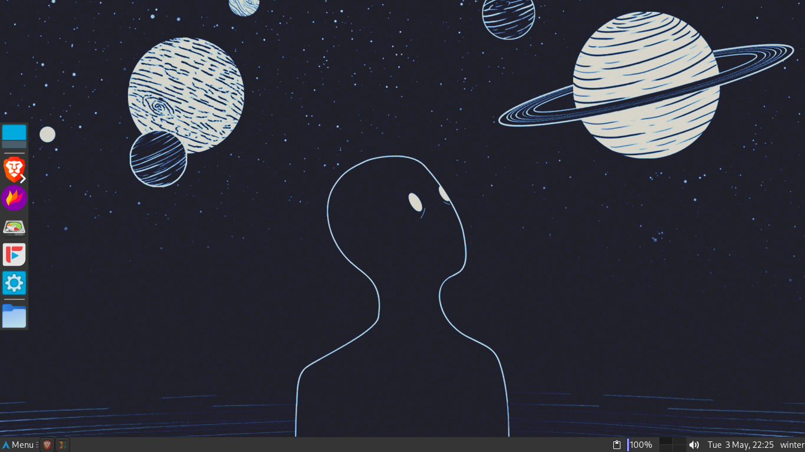
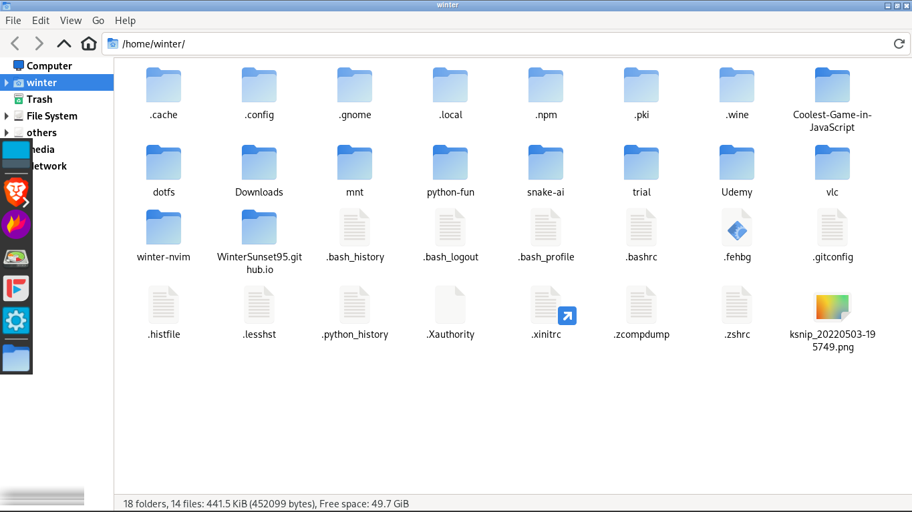
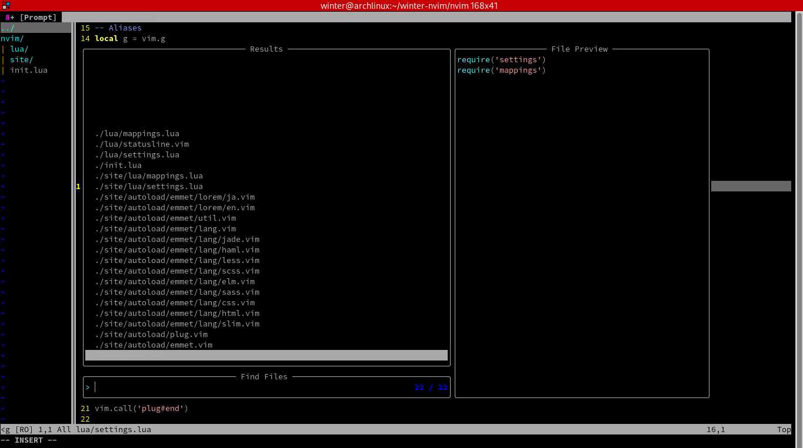
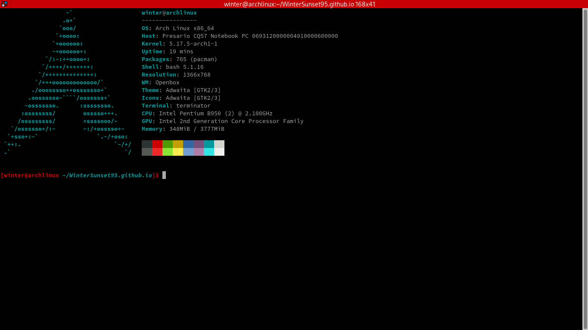

## Arch-Dotfiles
<h3>Quick overview</h3>

This repo contains my arch linux configs along with an automation script for full installation of said configs. Note that I have tried this script only a few times and might very well be error prone.

<h3>Installed features: </h3>

<h5>Window manager - Openbox</h5>

<h5>File manager - thunar</h5>

<h5>Panel - xfce4</h5>

<h5>Editor - neovim</h5>

<h5>Sound - pulseaudio</h5>

<h5>Minimum ram usage - About 250mb</h5>

